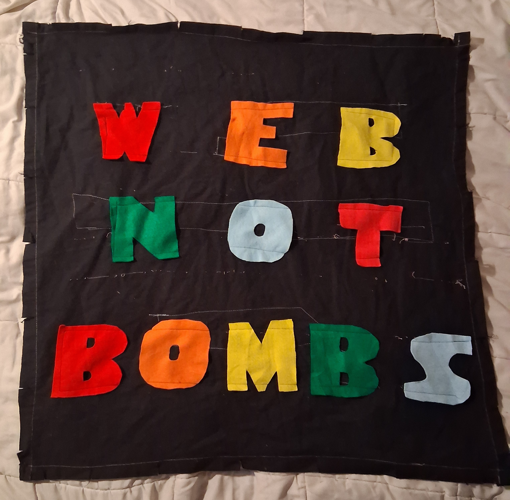
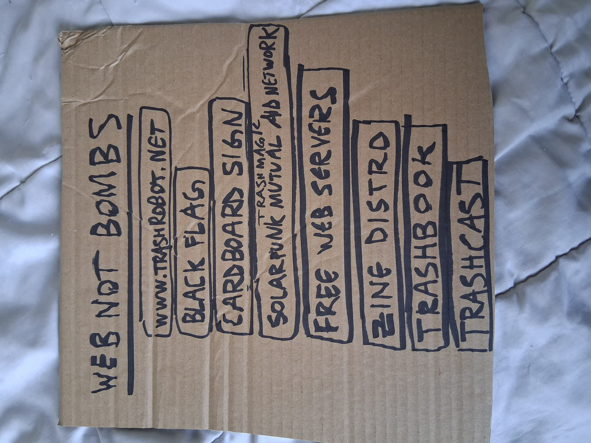

[](qrcode.png)




# [TRASH MAGIC SERVER](https://github.com/lafelabs/TRASH-MAGIC-SERVER)

 - [http://localhost/TRASH-MAGIC-SERVER/](http://localhost/TRASH-MAGIC-SERVER/)
 - [https://trashrobot.net/TRASH-MAGIC-SERVER/](https://trashrobot.net/TRASH-MAGIC-SERVER/)

TRASH MAGIC IS SELF-REPLICATING MEDIA ON THE [WORLD WIDE WEB](https://en.wikipedia.org/wiki/World_Wide_Web). SETS OF FILES REPLICATE FROM WEB SERVER TO WEB SERVER, SPREADING MEDIA AND THE TECHNOLOGY WHICH SUPPORTS THE MEDIA TOGETHER AS A UNIFIED WHOLE.  [PHP](https://en.wikipedia.org/wiki/PHP) SCRIPTS COMMUNICATE WITH THE SERVER SIDE FILE SYSTEM, [LOADING](php/load-file.txt), [SAVING](php/save-file.txt), [LISTING](php/list-files.txt), AND [DELETING](php/delete-file.txt)  FILES OF ALL KINDS, INCLUDING THE PHP SCRIPTS THEMSELVES. 

THE [SET](https://en.wikipedia.org/wiki/Set_(mathematics)) OF FILES CONTAINED HERE REPRESENTS A SELF-REPLICATING SET. THAT SET INLUDES THE PHYSICAL SERVERS, THE SOFTWARE WHICH RUNS ON THOSE SERVERS, THE PEOPLE WHO REPLICATE THE SERVERS, THE MEDIA WHICH TELLS PEOPLE HOW TO REPLICATE THE SERVERS, AND THE SOCIAL STRUCTURES WHICH SUPPORT REPLICATION.  WE TAKE "SET" TO BE AN ABSTRACT COLLECTION OF ELEMENTS IN THE MOST GENERAL MATHEMATICAL SENSE HERE.  THAT IS TO SAY, TRASH MAGIC IS A MATHEMATICAL FRAMEWORK FOR INTERACTING WITH SELF-REPLICATING SETS OF WHICH WE ARE ELEMENTS!

A PHP [SCRIPT CALLLED generate-dna.php](php/generate-dna.txt) GENERATES A [JSON](https://en.wikipedia.org/wiki/JSON) FILE CALLED THE DNA([dna.json](dna.json)), WHICH LISTS ALL THE FILES IN THE SET.  THIS JSON FILE IS USED BY THE PHP SCRIPT [replicator.php](php/replicator.txt), WHICH USES THAT LIST OF FILES TO COPY THE WHOLE SET FROM SERVER TO SERVER USING ONLY CLIENT SIDE ACTIONS! 

VARIOUS EDITOR APPLICATIONS EDIT EVERY ELEMENT OF THE SET OF FILES.  THE MAIN FILE [index.html](index.html) IS EDITED USING AN HTML EDITOR [edit-index.html](edit-index.html), THE WHOLE SET OF FILES IN THE MAIN FOLDER ARE EDITED USING [edit-html.html](edit-html.html), AND THE PHP FILES ARE EDITED IN THE [php/](php/) FOLDER WITH [edit-php.html](edit-php.html). CODE EDITORS US THE JAVASCRIPT LIBRARY [ACE.JS](https://ace.c9.io/) FOR SYNTAX HIGHLIGHTING.

TRASH MAGIC SERVERS ARE USED TO SPREAD FREE MEDIA ON FREE SOFTWARE THAT RUNS ON FREE HARDWARE VIA THE PHYSICAL NETWORKS OF THE WORLD. WE TAKE OLD COMPUTERS MADE USELESS BY THE [PLANNED OBSOLESCENCE](https://en.wikipedia.org/wiki/Planned_obsolescence) OF [BIG TECH](https://en.wikipedia.org/wiki/Big_Tech) AND PUT FREE SOFTWARE ON THEM WHICH BOTH CREATES AND SHARES MEDIA ON LOCAL NETWORKS. WE THEN DISRIBUTE THESE SERVERS FROM CARTS ALONG THE STREETS AND HIGHWAYS AND TRASNSIT LINES OF THE WORLD.  

THIS IS A PHYSICAL NETWORK OF FREE MEDIA DISTRIBUTION USING SELF-REPLICATING CODE.

## LANGUAGE ELEMENTS OF TRASH MAGIC SERVERS

 - [HTML](https://en.wikipedia.org/wiki/HTML)
 - [CSS](https://en.wikipedia.org/wiki/CSS)
 - [JAVASCRIPT](https://en.wikipedia.org/wiki/JavaScript)
 - [MARKDOWN](https://en.wikipedia.org/wiki/Markdown)
 - [JSON](https://en.wikipedia.org/wiki/JSON)
 - [PHP](https://en.wikipedia.org/wiki/PHP)
 - [LATEX](https://en.wikipedia.org/wiki/LaTeX)
 - [TEXT](https://en.wikipedia.org/wiki/Text_file)

## OPERATING SYSTEM ELEMENTS OF TRASH MAGIC SERVERS

 - [UBUNTU FREE OPERATING SYSTEM](https://ubuntu.com/download/desktop)
 - [XAMPP LOCAL PRIVATE WEB SERVER SOFTWARE](https://www.apachefriends.org/)
 - [CLOUD HOSTING AT EASYDNS.COM](https://easydns.com/)
 - [LOCAL SERVERS ON ANDROID WITH KSWEB](https://play.google.com/store/apps/details?id=ru.kslabs.ksweb&hl=en_US)
 - [BALENA ETCHER TO FLASH UBUNTU INSTALL DISKS](https://etcher.balena.io/)
 - [RASPBERRY PI SERVERS](https://www.raspberrypi.com/)
 - [APACHE WEB SERVER](https://www.apache.org/)

## PHYSICAL ELEMENTS OF SERVER NETWORK

 - BOOK SHOPS
 - STREETS/HIGHWAYS
 - PUBLIC TRANSIT NETWORKS
 - LIBRARIES
 - SHOPPING CARTS
 - CARDBOARD SIGNS
 - MOBILE SOLAR POWER STATIONS
 - TRASH MAGICIANS
 - TEXTILE HYPERLINKS(BLACK FLAGS)
 - PRINTED QR CODES
 - URLS WRITTEN ON TRASH WITH MARKER OR PAINT PEN
 - PHYSICAL SERVERS BUILT FROM TRASH
 - PHYSICAL SERVERS BUILT FROM RASPBERRY PI
 - PHYSICAL SERVERS ON PRIVATE COMPUTERS ON PRIVATE NETWORKS

## INSTALL TRASH MAGIC ON PRIVATE MACHINE

TO INSTALL TRASH MAGIC ON A WINDOWS OR MAC MACHINE RATHER THAN A LIBERATED LINUX MACHINE, WE WILL USE XAMPP, A LOCAL WEB SERVER WHICH HAS PHP SUPPORT BUILT IN. 

[DOWNLOAD AND INSTALL XAMPP HERE AT THIS LINK](https://www.apachefriends.org/)

ONCE IT IS INSTALLED, IT WILL SET UP A WEB SERVER IN THE FOLDER "c:\xampp\htdocs" ON WINDOWS. I'M NOT SURE WHAT FOLDER ON MAC.  THEN DOWNLOAD THE REPLICATOR AT [THIS LINK TO GITHUB](https://github.com/LafeLabs/TRASH-MAGIC-SERVER/blob/main/replicator.php) AND PLACE IT IN THE CORRECT FOLDER. ONCE THAT FILE IS IN THE FOLDER, YOU CAN RUN THE REPLICATOR SCRIPT BY CLICKING ON THE FOLLOWING LINK:

[http://localhost/replicator.php](http://localhost/replicator.php)

TO BUILD YOUR OWN TRASH MAGIC CODE REPOSITORIES, INCLUDING CLONES OF THIS ONE, SET YOUR GIT FOLDER THAT YOU DO DEVELOPMENT IN TO BE A SUB FOLDER OF "c:\xampp\htdocs" AND YOU WILL BE ABLE TO NAVIGATE FROM THE TOP TRASH MAGIC PAGE INTO ANY NUMBER OF PAGES YOU MAKE BELOW THAT LEVEL IN YOUR FOLDER TREE.

## REPLICATE A TRASH MAGIC SERVER

THIS IS HOW WE BUILD THE SERVERS THAT WILL MAKE UP THE SCALABLE NETWORK THAT EXISTS OUTSIDE OF THE SYSTEM OF PRIVATE PROPERTY!  THESE ARE LIBERATED SYSTEMS THAT HAVE NO USERS, NO PRIVATE DATA, NO INFORMATION OTHER THAN WHAT WE ARE TRYING TO SHARE IN ORDER TO BUILD A TRULY FREE NETWORK OF FREE INFORMATION! THIS IS A NETWORK OF PEOPLE, MACHINES AND MEDIA WITHOUT PROPERTY!


## WHAT YOU NEED FOR THIS:

 - TWO THUMB DRIVES WITH AT LEAST 8 GIGABYTES!
 - PAINT PENS!
 - A COMPUTER THAT IS NOT NEEDED FOR OTHER PURPOSES WHICH HAS A [USB TYPE A](https://en.wikipedia.org/wiki/USB_hardware) CONNECTION AND IS NOT EITHER A CHROME BOOK OR A RECENT APPLE!
 - A SECOND COMPUTER THAT ALSO HAS AN INTERNET CONNECTION AND USB A CONNECTION(OR CONVERTER FROM C TO A) TO DOWNLOAD THE INSTALL IMAGE(THIS CAN ALSO BE A TRASH MAGIC SERVER)
 - AN INTERNET CONNECTION, PREFERABLY A FAST ONE!
 - MAYBE AN HOUR OR TWO OF TIME

## STEP 1: PREPARE THE COMPUTER

MAKE ABSOLUTELY SURE THAT WHOEVER DONATED THE LAPTOP HAS GOT ALL THEIR DATA!  ALSO MAKE SURE THEY HAVE THEN DELETED ALL THEIR PERSONAL DATA FROM THE MACHINE TO BE SAFE!

## STEP 2: PAINT THE THUMB DRIVES!

WE USE BLUE TO INDICATED CONTENT AND RED TO INDICATE PLATFORM! THIS DISTINCTION IS USEFUL ENOUGH TO HAVE THIS BE A STEP ON ITS OWN!


WE USE BOTH COLORS AS A REJECTION OF THE BLUE PILL/RED PILL BINARY PRESENTED IN THE MATRIX!  BOTH PILLS ARE TAKEN AND WE ACCEPT THE DUALITY OF THE UNIVERSE!


## STEP 3: DOWNLOAD IMAGE FOR INSTALLING UBUNTU DESKTOP!


### [CLICK HERE FOR DOWNLOAD PAGE!](https://ubuntu.com/download/desktop)

YOU CAN JUST DOWNLOAD IT TO YOUR "DOWNLOADS" FOLDER AND LEAVE IT THERE, SINCE THAT'S EASY TO FIND!

## STEP 3: INSTALL [BALENA ETCHER](https://etcher.balena.io/) ON THE OTHER MACHINE!

### [CLICK HERE TO GO TO  DOWNLOAD PAGE!](https://etcher.balena.io/#download-etcher)

BALENA ETCHER IS FREE SOFTWARE THAT RUNS ON ALL MAJOR OPERATING SYSTEMS THAT CAN WRITE A UBUNTU INSTALL IMAGE ON A THUMB DRIVE! 

DOWNLOAD AND INSTALL THE SOFTWARE! IF YOU'RE ON AN EXISTING TRASH MAGIC SERVER(WHICH RUNS UBUNTU LINUX) YOU CAN JUST UNZIP THE FILE YOU DOWNLOAD AND THEN RUN THE PROGRAM BY CLICKING ON THE FILE CALLED "balena etcher" IN THE UNZIPPED FOLDER!

## STEP 4: FLASH INSTALL IMAGE ONTO RED THUMB DRIVE

PLACE RED PAINTED THUMB DRIVE INTO THE USB SLOT OF YOUR EXISTING COMPUTER!

IF YOU HAVE A NEWER COMPUTER YOU MIGHT NEED A CONVERTER TO FROM USB C TO USB A!

RUN BALENA ETCHER!  IT WILL ASK YOU WHERE THE IMAGE IS, AND YOU CAN GO FIND THAT IN YOUR DOWNLOADS FOLDER, AND IT WILL ALSO ASK WHAT DRIVE TO INSTALL, AND MAKE SURE IT'S THE ONE YOU JUST PLUGGED IN!

BE SURE THAT THIS THUMB DRIVE HAS NOTHING YOU DON'T WANT TO LOSE ON IT!

RUN BALENA ETCHER, WHICH WILL TAKE A FEW MINUTES AT LEAST, AND THAT WILL THEN BECOME YOUR INSTALL DISK!

EJECT THE DISK!

THIS IS NOW THE SEED THAT WILL MAKE TRASH(OLD COMPUTERS) INTO MAGIC! 

MAKE AS MANY AS YOU WANT!

## STEP 5: INSTALL UBUNTU!

LAST CHANCE TO SAVE ANY DATA FROM THE OLD MACHINE!

AFTER YOU'RE SURE THERE'S NO DATA YOU DON'T WANT TO LOSE, PUT THE THUMB DRIVE IN A USB A SLOT AND TURN THE COMPUTER ON WHILE PRESSING ONE OF THE FUNCTION KEYS. WHICH ONE?  DEPENDS ON YOUR COMPUTER! TRY GOOGLING "[make and model of your computer] INSTALL LINUX FROM THUMB DRIVE" OR SOMETHING LIKE THAT AND HOPEFULLY YOU CAN FIND THE RIGHT ONE FOR THE MACHINE YOU HAVE!  THIS CAN ALSO TURN UP IF YOU HAVE SOME WEIRD MACHINE THAT THIS WON'T WORK ON!  SOME MACHINES DON'T WORK WITHOUT A BUNCH OF NONSENSE, BUT YOU USUALLY JUST DO A BUNCH OF SEARCHES AND TRY THINGS AT RANDOM!  THIS DOESN'T REALLY REQUIRE TECHNICAL "SKILL" EXACTLY, JUST PATIENCE AND A WILLINGNESS TO TRY THINGS AND NAVIGATE ANNOYING ONLINE FORUMS FULL OF ANNOYING PEOPLE!

ONCE YOU GET THE INSTALL TO START WORKING, YOU'VE GOT MAYBE THE BETTER PART OF AN HOUR OF THE USUAL COMPUTER SETUP TYPE STUFF, YOU WILL CLICK "OK" MANY TIMES, SET THE TIME ZONE, SET THE LANGUAGE, AND SET A USERNAME AND PASSWORD!

WE WANT THE USERNAME AND PASSWORD TO BOTH BE VERY SIMPLE, VERY EASY TO GUESS, AND ALSO WRITTEN IN HUGE LETTERS IN PAINT PEN IN MULTIPLE PLACES ON THE COMPUTER!  THIS MACHINE IS ABOUT TO BECOME LIBERATED FROM THE WHOLE SYSTEM OF PRIVATE AND PERSONAL DATA, USED ONLY FOR THE FREE SHARING OF FREE MEDIA!

MAKE THE USERNAME GENERIC AND NOT YOUR ACTUAL NAME OR IDENTIFYING PRIVATE INFORMATION!

EXAMPLE: MAKE THE USERNAME "TRASHMAGIC" AND THE PASSWORD "TRASHMAGIC"!

MANY UBUNTU MACHINES USE LOGIN UBUNTU AND PASSWORD UBUNTU(LOWERCASE)!

UBUNTU IS A FREE SYSTEM OF FREE SOFTWARE FOR MAKING FREE MEDIA! ALL FREE! NO MONEY!

BE SURE TO WRITE THE LOGIN AND PASSWORD IN BIG LETTERS IN PAINT PEN ON THE MACHINE IN MORE THAN ONE PLACE!

## STEP 6: MAKE SYSTEM INTO A TRASH MAGIC SERVER 

MAKE SURE THE NEW TRASH MAGIC MACHINE IS ON THE INTERNET!

OPEN A [TERMINAL](https://ubuntu.com/tutorials/command-line-for-beginners#1-overview) BY CLICKING ON THE ACTIVITIES ITEM ON THE UPPER LEFT OF THE SCREEN AND THEN TYPING "TERMINAL" AND IT SHOULD POP UP AND YOU CAN CLICK IT!


IN THE TERMINAL, COPY AND PASTE EACH OF THE FOLLOWING LINES ONE BY ONE:

```
sudo apt update
sudo apt install apache2 -y
sudo apt install php libapache2-mod-php -y
cd /var/www/html
sudo rm index.html
sudo apt-get install curl
sudo curl -o replicator.php https://raw.githubusercontent.com/LafeLabs/WEB-NOT-BOMBS/refs/heads/main/php/replicator.txt
cd ..
sudo chmod -R 0777 *
cd html
php replicator.php
sudo chmod -R 0777 *
ln -s /var/www/html ~/Desktop/html
```
COMPLETE THE INSTALLATION BY APPLYING PERMANENT PAINT WITH PAINT PENS OR ANY OTHER PAINT AS LONG AS YOU DON'T JAM THE KEYBOARD OR BLOCK THE SCREEN! 

MAKE IT LOOK LIKE FREE ART!

MAKE IT STAND OUT!

MAKE IT LOUD!

## STEP 7: ADD AND REPLICATE CONTENT!

NOW OPEN A WEB BROWSER ON THE TRASH MAGIC SERVER AND POINT THE BROWSER TO "http://localhost":

[LINK FOR LOCALHOST](http://localhost)

ONCE THIS IS ALIVE YOU CAN EDIT THE SYSTEM IN THE BROWSER!

THERE IS A LINK TO EDIT!

THERE IS A LINK TO BRANCH!

ALL WEB PAGES CAN ALL BE EDITED AND BRANCHED!

BUILD A WHOLE WORLD OF LOCAL WEB PAGES!

BUILD PAGES FOR ARTISTS, PLACES, ORGANIZATIONS, IDEAS, ACTIONS, COMMUNITIES, SYSTEMS, MACHINES, OBJECTS, STORIES, AND ANY OTHER THING WHICH MIGHT BE REPRESENTED BY HUMAN LANGUAGE!

ASK AROUND WHO KNOWS HTML AND COLLABORATE WITH THEM!
IF YOU KNOW HTML, YOU CAN MAKE PAGES FOR ALL YOUR FRIENDS WHO DON'T!

IF YOU DON'T KNOW HTML, YOU CAN LEARN WITH ANY OF VARIOUS TOOLS, BUT WE LIKE [W3SCHOOLS](https://www.w3schools.com/html/)!

MAKE WEB PAGES FOR ALL THE CONTENT CREATORS WHICH HAVE THEIR CONTACT INFO, SOCIALS, PAYMENT LINKS, ARTIST STATEMENTS, SO THAT WE CAN ALL SUPPORT EACH OTHER AS THE COMMUNITY GROWS!

IF YOU SEE ANY IMAGES YOU DON'T WANT JUST DELETE THEM IMMEDIATELY USING THE IMAGE FEED APP!

WANT TO POST WITHOUT CODE? JUST POST ON PAPER OR CARDBOARD, PHOTOGRAPH, AND UPLOAD! THIS IS AN EASY WAY TO POST THINGS!

PUT CONTENT INTO FOLDERS AND IT WILL LOAD IN THE PAGE REPRESENTED BY THAT FOLDER!

MANY TIMES, WHEN REPEATING THIS PROCESS, IT IS USEFUL TO GO BACK TO THE TERMINAL AND ENTER :

```
cd /var/www
sudo chmod -R 0777 *
```
TO MAKE SURE AL WEB FILES ARE FULLY FREE TO EDIT AND DELETE AS WELL AS READ!

## STEP 8: CREATE THE CONTENT THUMB DRIVE!

THIS IS THE BLUE PAINTED THUMB DRIVE! 

PUT IT IN THE TRASH MAGIC SERVER(YOU DON'T NEED TO USE THE RED ONE EVER AGAIN ON THIS MACHINE NOW AND CAN REMOVE IT)!

COPY ALL THE FILES FROM THE FOLDER "/var/www/html" INTO THE THUMB DRIVE!

NOW YOU CAN EJECT THE DRIVE AND YOU'RE READY TO DISTRIBUTE THAT TO THE NEXT TRASH MAGIC SERVER, SPREADING AND GROWING THE NETWORK OF CONTENT THROUGH DIRECT CONTACT WITH REAL LIVE HUMANS IN THE PHYSICAL WORLD!

## STEP 9: PHYSICAL DISTRO!

THIS IS WHERE WE FINALLY ARE DISTRIBUTING MEDIA!

GO FIND A SPOT WHERE PEOPLE GATHER WHO ARE IN THE COMMUNITY YOU WANT TO DISTRIBUTE TO!

PUT YOUR TRASH MAGIC SERVER ON THE WIRELESS NETWORK!

CLICK THE WIFI LINK TO FIND OUT INFORMATION ABOUT THE WIFI CONNECTION, AND FIND THE "IP ADDRESS", WHICH IS 4 NUMBERS SEPARATED BY PERIODS, USUALLY WITH THE MIDDLE TWO BEING ZEROS, LIKE "10.0.0.7"!

WHEN YOU HAVE THAT, YOU CAN PUT 

http://[ip address here]

INTO A BROWSER BAR ON ANY MACHINE IN THE VENUE AND IT WILL BE ON THE SERVER!

NOTE THAT EVERYONE CAN EDIT AND DELETE AND ADD AS WELL AS VIEW FILES!

THIS IS ALL FREE AND OPEN LIKE A CHALK BOARD!

DON'T WANT STUFF LOST? BACK IT UP! 

THAT'S WHAT THE BLUE DRIVE IS FOR!

MANY PEOPLE CAN ALL BE EDITING THEIR PAGES AT THE SAME TIME, MAKING A WHOLE NETWORK OF WEB PAGES REAL FAST IN A DECENTRALIZED WAY!

ONCE ANY MACHINE HAS LOADED THE PAGE, CLICK ON THE QRCODE LINK TO GET A QR CODE FOR THE NEXT MACHINE TO SCAN!

PRINT THOSE QR CODES OUT IF YOU WANT AND HAVE A PRINTER, AND USE THEM TO PHYSICALLY HAND PEOPLE LINKS IN THE VENUE!

## STEP 10: PROMOTION IN PHYSICAL SPACE AND ON PUBLIC WEB!

WE WANT TO GROW THE NETWORK!

THAT MEANS WE WILL CREATE WHITE RABBITS INTO THIS NETWORK FROM MANY PLACES!

THIS IS WHERE THE OTHER SIDE OF TRASH MAGIC COMES IN: USING CARDBOARD TRASH AND QR CODES TO MAKE SELF-REPLICATING MEDIA AND USING TRASH MAGIC ON CLOUD SERVERS SOME OF US PAY FOR AND SHARE TO LINK FROM CARDBOARD TO THE WEB AND THE WEB TO PEOPLE AND PLACES AND THINGS IN OUR NETWORK!

ADD QR CODES TO EVERYTHING!

USE TRASH AS MEDIA!

USE MEDIA TO GUIDE PEOPLE INTO COMMUNITY!

USE COMMUNITY TO GROW FREE MEDIA!

USE FREE MEDIA TO GROW COMMUNITY!

## THE LAWS OF TRASH:

1. EVERYTHING FREE FOR EVERYONE EVERYWHERE RIGHT NOW!
2. NO ONE IS FREE UNTIL EVERYONE IS FREE!

[file-list.md](file-list.md)


